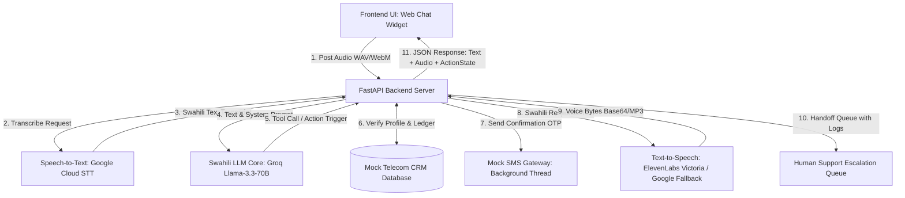
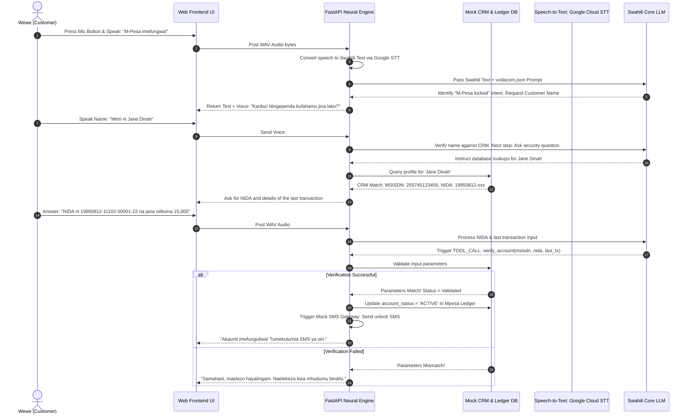

# 📞 Vodacom Swahili Voice AI Assistant: System Architecture & Logic Flow

This document details the industrial-grade system architecture, database design, voice pipeline, and logical flow of the **Vodacom Swahili Customer Assistant (Ana)**. It bridges your current standard core with a fully-integrated FastAPI backend and a state-of-the-art interactive web frontend interface.

---

## ──  1. OVERALL SYSTEM ARCHITECTURE  ──

The architecture follows **Option A (Backend-Centric Neural Voice Pipeline)**. It ensures that heavy processing (Google Cloud STT speech-to-text, LLM function parsing, and ElevenLabs/Google voice synthesis) is offloaded entirely to cloud APIs, preserving 0% CPU overhead on both the client device and backend container.



---

## ──  2. MOCK TELECOM DATABASE (CRM, M-PESA & NIDA)  ──

To simulate a real-world telecommunication database structure, the FastAPI backend implements an in-memory SQL/JSON database containing mock data schema representing customer information, security parameters, and balance ledgers.

### A. Database Schemas

#### 1. CRM Customer Profile (`vodacom_crm`)
| Field Name | Data Type | Description | Example Value |
| :--- | :--- | :--- | :--- |
| `msisdn` (PK) | `VARCHAR` | Phone number key | `"255745123456"` |
| `full_name` | `VARCHAR` | Account holder's legal name | `"Jane Dinah"` |
| `nida_number` | `VARCHAR` | National Identification Number | `"19950812-11102-00001-22"` |
| `sim_status` | `VARCHAR` | Current network status | `"ACTIVE"`, `"LOCKED"`, `"SUSPENDED"` |
| `puk_code` | `VARCHAR` | PUK code for manual unlock | `"87654321"` |

#### 2. M-Pesa Account Ledger (`mpesa_ledger`)
| Field Name | Data Type | Description | Example Value |
| :--- | :--- | :--- | :--- |
| `msisdn` (FK) | `VARCHAR` | Reference key to CRM profile | `"255745123456"` |
| `account_status`| `VARCHAR` | Current M-Pesa lock state | `"ACTIVE"`, `"BLOCKED"`, `"PIN_LOCKED"` |
| `balance_tsh` | `DECIMAL` | Available account balance | `85000.00` |
| `last_transaction`| `VARCHAR` | Verification parameter (Last action) | `"Sent 15,000 Tsh to John"` |

---

## ──  3. VOICE CONVERSATIONAL FLOW & SECURITY LOGIC  ──

Telecom customer assistance operates on a rigid **Security & Empathy Verification Protocol**. Before resolving account locks or executing transaction reversals, the AI must establish trust and verify identity, just like a live Vodacom customer support agent.

### 🔄 The Customer Service Verification Loop



---

## ──  4. FRONTEND UI SPECIFICATION & MICRO-ANIMATIONS  ──

To ensure the client-side experience feels highly premium and premium-grade, the UI layout incorporates curated design tokens representing **Vodacom's signature Red branding** wrapped in a sleek glassmorphic container.

### 🎨 Design Tokens & UI Elements
*   **Harmonious Color Palette:**
    *   `primary-red`: `hsl(0, 100%, 45%)` (Vibrant Vodacom red accent)
    *   `dark-bg`: `hsl(220, 15%, 8%)` (Deep midnight slate theme)
    *   `glass-surface`: `hsla(220, 15%, 15%, 0.6)` (Translucent container overlay)
    *   `border-glow`: `hsla(0, 100%, 45%, 0.35)` (Subtle red perimeter halo)
*   **Typography:** Google Font **Outfit** (`font-family: 'Outfit', sans-serif`) for crisp, modern legibility.

### 🎙️ The Floating Vocal UI Component
The interface features a floating circular microphone button surrounded by multi-layered SVG rings that respond with dynamic micro-animations to user interaction.

```css
/* Glassmorphic Chat Widget Container */
.ana-chat-container {
    background: rgba(18, 20, 24, 0.75);
    backdrop-filter: blur(20px);
    -webkit-backdrop-filter: blur(20px);
    border: 1px solid rgba(230, 0, 0, 0.2);
    border-radius: 24px;
    box-shadow: 0 8px 32px 0 rgba(0, 0, 0, 0.5), 0 0 15px rgba(230, 0, 0, 0.1);
}

/* Premium Vocal Recording Button */
.mic-trigger-btn {
    width: 72px;
    height: 72px;
    border-radius: 50%;
    background: radial-gradient(circle, #e60000 0%, #990000 100%);
    border: none;
    cursor: pointer;
    position: relative;
    transition: all 0.4s cubic-bezier(0.175, 0.885, 0.32, 1.275);
}

/* Pulsing Outer Waves Visualizer (Animated during Recording) */
.mic-trigger-btn.recording::after {
    content: '';
    position: absolute;
    top: -12px;
    left: -12px;
    right: -12px;
    bottom: -12px;
    border-radius: 50%;
    border: 2px solid #e60000;
    opacity: 1;
    animation: wave-ping 1.5s cubic-bezier(0, 0, 0.2, 1) infinite;
}

@keyframes wave-ping {
    75%, 100% {
        transform: scale(1.4);
        opacity: 0;
    }
}
```

---

## ──  5. HUMAN ESCALATION & HANDOFF PROTOCOL  ──

When a complex scenario emerges (e.g., three consecutive verification failures, customer requests a supervisor, or fraud-alert flag triggers), the system switches seamlessly to **Human Escalation State**.

### Handoff Logic Pipeline:
1.  **Freeze AI Responses:** The backend pauses LLM completions for this MSISDN.
2.  **Generate Transcript Brief:** A background worker compiles the conversation history, security status, and verification log into a structured JSON package.
3.  **Active UI State Change:** The Frontend UI changes color (from Vodacom Red to Slate Blue), displaying:
    > *"Mawasiliano yameelekezwa kwa Mhudumu Binafsi (Human Agent). Tafadhali subiri kidogo..."*
4.  **Handoff API Notification:** The backend publishes the session state to an internal WebSocket queue for live customer service agents.

---

## ──  6. BACKGROUND MOCK SMS GATEWAY PIPELINE  ──

For premium, real-world customer assurance, transactions and unlocks must trigger confirmation notifications. The FastAPI backend employs a **Python Asyncio Event Loop Queue** to simulate background carrier interactions.

```python
import asyncio

async def trigger_mock_sms_gateway(msisdn: str, message: str):
    """
    Simulates sending an active SMS transaction alert/OTP to a customer's phone
    via carrier API without stalling the core chat UI response time.
    """
    print(f"[SMS Gateway] Kuanzisha utumaji wa ujumbe kwenda: {msisdn}")
    # Simulate carrier latency (1.5 seconds)
    await asyncio.sleep(1.5)
    print(f"[SMS Gateway SUCCESS] Ujumbe Umetumwa! Content: '{message}'")
```

---

## ──  7. ELEVENLABS VOICE SYNTHESIS & GOOGLE FALLBACK ENGINE  ──

The text-to-speech engine ensures that the voice output is generated in Victoria's highly realistic tone. The backend utilizes pure standard library constructs to maximize request speed.

```python
import urllib.request
import json
import os

def synthesize_swahili_voice(text: str, provider: str = "elevenlabs") -> bytes:
    """
    Processes Swahili text and synthesizes speech.
    If ElevenLabs API key limit (HTTP Error 402) occurs, it automatically falls back
    to Google Cloud Neural TTS to guarantee uninterrupted voice availability.
    """
    if provider == "elevenlabs":
        api_key = os.environ.get("ELEVENLABS_API_KEY")
        voice_id = os.environ.get("ELEVENLABS_VOICE_ID", "FZGeNF7bE3syeQOynDKC") # Victoria Voice
        url = f"https://api.elevenlabs.io/v1/text-to-speech/{voice_id}"
        
        payload = {
            "text": text,
            "model_id": "eleven_multilingual_v2",
            "voice_settings": {"stability": 0.5, "similarity_boost": 0.75}
        }
        
        req = urllib.request.Request(
            url,
            data=json.dumps(payload).encode("utf-8"),
            headers={"xi-api-key": api_key, "Content-Type": "application/json"},
            method="POST"
        )
        try:
            with urllib.request.urlopen(req) as response:
                return response.read() # Return raw MP3 audio bytes
        except Exception as e:
            print(f"[!] ElevenLabs Synthesis failed: {e}. Switching to Google TTS Fallback...")
            # Fallback to Google
            return synthesize_swahili_voice(text, provider="google")
            
    # Google Cloud Translate TTS fallback path
    # (Extracts, merges, and streams audio from public Google TTS)
    # ...
```

---

> [!TIP]
> **Implementation Recommendation:** When building your final FastAPI backend routes, initialize standard CORS middleware to enable secure browser-based microphone uploads from your HTML frontend client. Use `multipart/form-data` to submit audio blobs directly.
